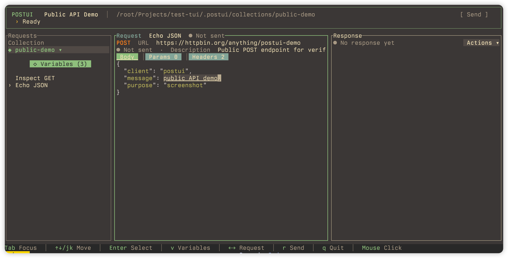

# PostUI

这个软件是我在某企畸形的开发环境使用的个人工具, 因为只能用到 `GET` 和 `POST`, 所以我只有这两个功能. Linux 个 windows 都支持(虽然我是Mac)

界面以鼠标操作为主

## 界面预览



## 构建

### 本地构建

环境：

- Rust 1.85 或更高版本
- Rust 2024 edition
- Linux amd64：`x86_64-unknown-linux-musl`
- Windows amd64：`x86_64-pc-windows-msvc`

```bash
rustup target add x86_64-unknown-linux-musl
cargo build --release --target x86_64-unknown-linux-musl
```

Linux 发布包：

```bash
./package-linux.sh
```

Windows amd64 构建：

```powershell
rustup target add x86_64-pc-windows-msvc
cargo build --release --target x86_64-pc-windows-msvc
```

Windows 发布包：

```powershell
.\package-windows.ps1
```

## 配置

一个包含 `.postui/` 的目录就是一个工作区：

```text
.postui/
├── postui.yaml
└── requests/
    ├── 01-list.http
    └── 02-detail.http
test_files/
temp/
```

项目配置 `.postui/postui.yaml`：

```yaml
name: 示例接口
timeout: 30

directories:
  uploads: test_files
  downloads: temp

headers:
  - name: Accept
    value: application/json

variables:
  host: https://api.example.test
  token:
  item_id:
```

所有字段都可省略。相对上传和下载目录以项目根目录为基准。在项目目录或子目录运行 `postui` 会自动发现工作区，也可以运行 `postui /path/to/project`。

`requests/` 目录也可以省略，空工作区仍会正常打开。PostUI 只加载配置中已有的请求；请在 `.postui/requests/` 中维护请求文件。

个人界面配置位于 `${XDG_CONFIG_HOME:-$HOME/.config}/postui/config.yaml`，Windows 位于 `%APPDATA%\postui\config.yaml`：

```yaml
language: zh
theme: ocean
```

### 请求文件

支持 `.http`、`.rest` 和 `.curl` 文件。请求文件使用 curl 格式：

```text
# @name 查询用户
# @description 查询指定用户
# @timeout 10
# @extract user_id = data.id
curl --request GET "{{host}}/users/{{item_id}}"
```

变量格式：`{{variable_name}}`。

支持的 HTTP 方法：`GET`、`POST`。

完整配置字段见[配置与请求文件](docs/configuration.md)。
