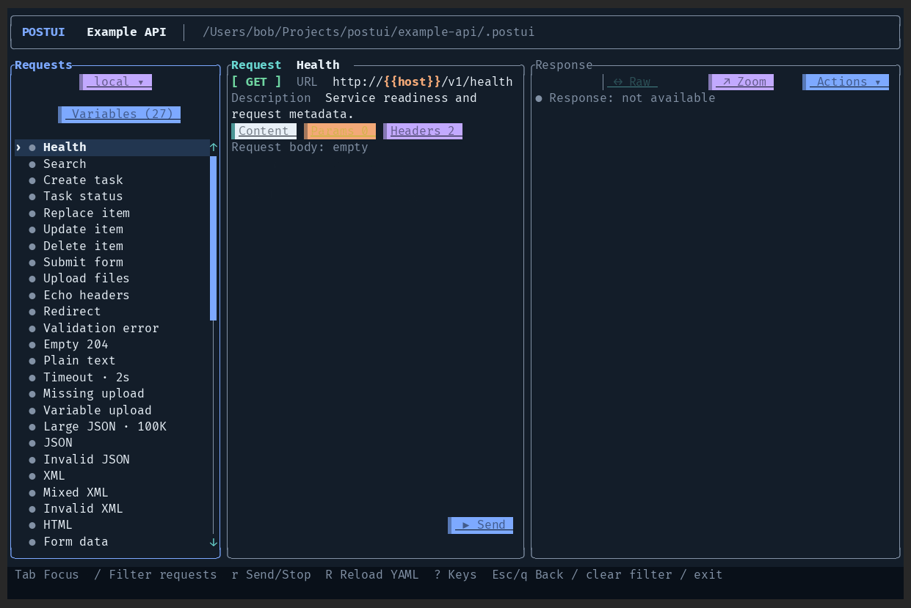

# PostUI

PostUI 是一个跨平台的接口测试软件, 开发的原因是我操蛋的开发环境和测试环境. 这个软件是配置优先的,所有的接口都依赖配置文件, tui 界面只能做简单的编辑.


## 特性

### 多主题


### 可编辑



### 高性能


## 安装

### macOS 和 Linux

```bash
curl -fsSL https://raw.githubusercontent.com/refiget/postui/main/install.sh | bash
```

**注意**: 该操作不会 append `path` 到 `zsh` 或者 `bash`. 如有需要,留意安装后的提示手动 append 即可.

### Windows

```powershell
& ([scriptblock]::Create((Invoke-WebRequest -UseBasicParsing https://raw.githubusercontent.com/refiget/postui/main/install.ps1).Content))
```

安装完成后重新打开 PowerShell，或执行脚本输出的 PATH 命令，再运行 `postui --version`。

## 构建

项目使用 Rust 2024 edition，`Cargo.toml` 声明 `rust-version = "1.85"`。

```bash
cargo build --release
```

平台发布包使用对应脚本构建：

```bash
./package-linux.sh
./package-macos.sh
./package-macos.sh --target x86_64-apple-darwin
./package-macos.sh --target aarch64-apple-darwin
```

```powershell
.\package-windows.ps1
```

## 配置

最小工作区只需要一个请求文件：

```text
.postui/
└── requests/
    └── health.yaml
```

```yaml
# .postui/requests/health.yaml
name: Health
method: GET
url: https://example.test/health
```

完整目录可以包含项目默认值和场景配置：

```text
.postui/
├── postui.yaml
├── scenarios/
│   ├── dev.yaml
│   └── test.yaml
└── requests/
    └── health.yaml
```

```yaml
# .postui/postui.yaml
default_scenario: dev
headers:
  Accept: application/json
variables:
  token:
    value:
    secret: true
```

```bash
postui /path/to/project
postui /path/to/project/.postui --scenario test
```

未指定路径时，PostUI 从当前目录向上查找最近的 `.postui`。未找到可读取的工作区时直接退出。

变量使用 `{{name}}`。Header 使用映射，重复值使用字符串列表。按 `R` 重新读取 YAML。请求列表中的删除操作需要确认，并会删除源文件。

完整字段和合并规则见[配置参考](docs/configuration.md)。

## 个人配置

个人界面配置与工作区配置分开存放，模板见 [config.example.yaml](config.example.yaml)。

```yaml
language: en
theme: gruvbox-dark
max_response_display_bytes: 16777216
max_response_bytes: 67108864
```

Linux 默认路径为 `${XDG_CONFIG_HOME:-$HOME/.config}/postui/config.yaml`，Windows 默认使用 Roaming AppData。也可以通过 `--config <路径>` 指定文件。

## 操作

响应区域提供 Raw、Formatted 和 Headers 页签。复制与下载使用原始响应内容。JSON 按视口格式化；XML 和表单数据提供格式化视图；其他支持的文本格式使用分页语法高亮。

鼠标单击选择请求，双击发送请求。发送中的请求忽略双击。

| 按键 | 操作 |
| --- | --- |
| `Tab` / `Shift+Tab` | 在主页容器之间切换焦点 |
| `j` / `k` | 在当前容器内移动 |
| `h` / `l` | 在当前容器的字段或页签间移动 |
| `/` | 搜索请求；响应区聚焦时搜索响应内容 |
| `n` / `N` | 跳转到下一处或上一处响应匹配 |
| `r` | 发送或取消请求 |
| `R` | 重新加载工作区 |
| `w` | 选择场景 |
| `v` | 打开变量 |
| `o` | 打开响应操作 |
| `u` | 恢复当前请求的临时修改 |
| `X` | 恢复当前场景的全部临时修改 |
| `?` / `F1` | 打开当前上下文的快捷键表 |

参数和请求头使用 `a` 添加、`Enter` 编辑、`Delete` 或 `d` 删除。空格启停请求头。这些表格操作只影响当前会话。

## 本地示例

本地接口和请求示例位于 `example-api/`：

```bash
./example-api/start.sh
cargo run -- example-api --scenario local
```

界面素材和交互位于 [design-lab](design-lab/README.md)。
